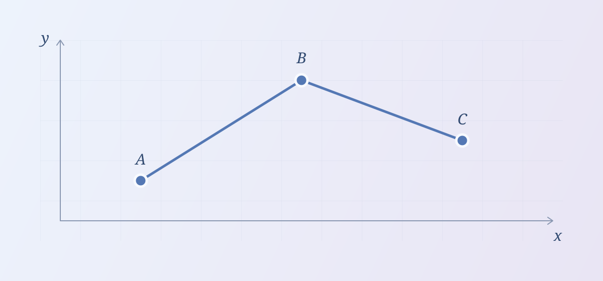

这篇文章集中展示本博客支持的 Markdown 写法。普通文字、公式和图形都直接参与排版；需要记住的语法则放在代码块里，方便复制到新文章中。

阅读时可以试着折叠提示框、复制代码、点击图片，或沿着引用跳到文末的参考文献。页面顶部的主题切换也可以用来对比浅色与深色下的效果。

## 文字与段落

### 强调、链接与行内代码

这是一段普通文字，包含 **粗体**、_斜体_、_**粗斜体**_、~~删除线~~，以及行内代码 `a[i] += b[i]`。

中文标点旁边也可以使用强调：**环（Ring）**是一个代数结构；中文**（补充说明）**后面可以紧接正文；**$x^2$（公式）**也可以放在粗体中。

链接可以指向[博客首页](/blog/)，也可以跳到本文的[求和定理](#sum-theorem)。[这条链接使用引用式定义][blog-home]，而 <https://explodingkonjac.github.io/blog/> 展示了自动链接。

反斜杠可以保留特殊符号：\*这里的星号不会变成斜体\*。要在行内代码里写反引号，可以使用两个反引号包围内容：`` `value` ``。

```markdown
**粗体**、_斜体_、_**粗斜体**_、~~删除线~~
中文**（补充说明）**后面紧接正文。
[求和定理](#sum-theorem)
```

### 换行与分隔线

这一行用行末的反斜杠手动换行。\
这一行仍然属于同一个段落。

空一行则会开始新的段落。英文排版还会处理引号、破折号和省略号，例如："Small details" -- they matter...

---

上面是一条由 `---` 产生的分隔线。

### 更细的标题层级

二级、三级标题会进入文章目录；标题旁边的 `#` 可以用来获取对应位置的链接。

#### 四级标题

适合一小段推导中的子步骤。

##### 五级标题

可以进一步划分内容。

###### 六级标题

这是 Markdown 支持的最深标题层级。文章的一级标题已经由页首的标题提供。

## 列表、引用与表格

### 列表与任务清单

- 一条普通的无序列表项。
- 一条包含子列表的列表项。
  - 子项可以包含 **强调**。
  - 也可以包含公式 $a^2+b^2=c^2$。

1. 写出定义。
2. 给出推导。
   1. 先处理边界情况。
   2. 再考虑一般情况。
3. 用例子检查结论。

任务清单也可以展示完成状态；这里的方框用于展示文章中记录的状态。

- [x] 一个已完成的条目。
- [ ] 一个尚未完成的条目。

### 块引用

> 先把问题说清楚，再把推导写完整。
>
> 块引用可以包含多个段落，也可以嵌套：
>
> > 一个小例子往往比一长串符号更容易检查。

### 表格

| 写法           | 渲染结果 | 用途             |
| -------------- | -------- | ---------------- |
| `**重点**`     | **重点** | 强调结论         |
| `` `sum(n)` `` | `sum(n)` | 行内代码         |
| `$n^2$`        | $n^2$    | 行内公式         |
| `a \| b`       | a \| b   | 在单元格中写竖线 |

表格较宽时，可以在表格内部横向滚动。

## 数学公式

### 行内公式与常用数集

用 `$...$` 插入行内公式，例如 $f(x)=x^2+1$。本博客还提供了四个简写：`\NN`、`\ZZ`、`\QQ`、`\RR`，对应 $\NN\subseteq\ZZ\subseteq\QQ\subseteq\RR$。

### 独立公式与多行推导

用单独成行的 `$$` 包围独立公式。对齐的多行推导可以这样写：

```latex
\begin{aligned}
S_n &= 1+2+\cdots+n, \\
2S_n &= n(n+1), \\
S_n &= \frac{n(n+1)}{2}.
\end{aligned}
```

$$
\begin{aligned}
S_n &= 1+2+\cdots+n, \\
2S_n &= n(n+1), \\
S_n &= \frac{n(n+1)}{2}.
\end{aligned}
$$

### 矩阵、分段函数与局部宏

矩阵可以和向量放在同一条公式里：

$$
\begin{pmatrix}
1 & 1 \\
0 & 1
\end{pmatrix}
\begin{pmatrix}x\\y\end{pmatrix}
=\begin{pmatrix}x+y\\y\end{pmatrix}.
$$

分段函数、上下标与颜色也可以直接使用：

$$
|x|=\begin{cases}
\color{blue}{x}, & x\geq 0,\\
-x, & x<0.
\end{cases}
\qquad
\sum_{k=0}^{n}\binom{n}{k}=2^n.
$$

局部宏可以在一条公式内定义并使用。下面的 `\newcommand` 定义了取上整记号：

```latex
\newcommand{\ceil}[1]{\left\lceil #1\right\rceil}
\ceil{\frac{7}{3}}=3
```

$$
\newcommand{\ceil}[1]{\left\lceil #1\right\rceil}
\ceil{\frac{7}{3}}=3.
$$

## 定义、定理与证明

数学环境使用 `:::环境名[可选标题]{#可选锚点}` 开始，以 `:::` 结束。内部仍然可以写段落、列表、代码与公式。下面用同一个求和问题展示全部八种数学环境。

```markdown
:::theorem[等差求和]{#sum-theorem}
对正整数 $n$，有 $S_n=\frac{n(n+1)}{2}$。
:::
```

:::definition[前缀和]
对非负整数 $n$，定义 $S_n=\sum_{k=1}^{n}k$，并约定空和 $S_0=0$。
:::

:::lemma[首尾配对]
对 $1\leq k\leq n$，有 $k+(n+1-k)=n+1$。
:::

:::proposition[相邻项之差]
对正整数 $n$，有 $S_n-S_{n-1}=n$。
:::

:::theorem[等差求和]{#sum-theorem}
对非负整数 $n$，有

$$
S_n=\frac{n(n+1)}{2}.
$$

:::

:::proof
$n=0$ 时结论直接成立。对正整数 $n$，将同一个和分别按正序、逆序排列，再逐项相加：

$$
\begin{aligned}
2S_n
&=\sum_{k=1}^{n}\bigl(k+(n+1-k)\bigr)\\
&=n(n+1).
\end{aligned}
$$

两边除以 $2$ 即得结论。证明环境会自动在末尾添加结束符号。
:::

:::corollary[偶数项前缀]
令 $n=2m$，可得 $S_{2m}=m(2m+1)$。
:::

:::example[代入一个小规模]
当 $n=4$ 时，$S_4=1+2+3+4=10=\frac{4\cdot5}{2}$。
:::

:::remark
环境标题是可选的；这个备注只保留默认标签。环境的锚点可以像普通标题一样被链接，例如回到[等差求和定理](#sum-theorem)。
:::

## 可折叠提示与嵌套

`note`、`tip`、`warning` 默认展开。点击标题或右侧的小箭头，可以观察内容和箭头一起平滑展开、收起；键盘聚焦标题后也可以按 Enter 或空格操作。

:::note[补充说明]
提示框里的内容仍然是普通 Markdown。

- 可以列出条件。
- 可以强调 **容易遗漏的细节**。
- 也可以写一个简短公式：$S_0=0$。

:::

:::tip[试着折叠这一段]
收起后，标题会留在原处。再次点击标题就能展开内容。
:::

:::warning[适用范围]
结论往往有前提。把限制条件放在这里，可以提醒读者在套用公式前先检查条件。
:::

嵌套环境时，让外层使用更多的冒号：

```markdown
::::note[外层说明]
这一段属于外层。

:::tip[内层提示]
这一段可以独立收起。
:::
::::
```

::::note[外层说明]
这一段属于外层，下面的提示可以独立折叠。

:::tip[内层提示]
先折叠内层，再收起和展开外层，试试看。
:::
::::

## 代码块

### 语法高亮、行号与复制

围栏后标注语言即可启用对应的高亮。代码块顶部显示语言名，右侧的复制图标会复制完整源码，左侧的行号不会被复制。

下面的 C++ 代码使用真实的 Tab 缩进，每个 Tab 按四个字符宽度显示。可以复制后检查缩进和空行是否保留。

```cpp
#include <iostream>

long long triangular(long long n) {
	return n * (n + 1) / 2;
}

int main() {
	for (long long n = 0; n <= 4; ++n) {
		std::cout << n << ": " << triangular(n) << '\n';
	}
}
```

同一篇文章可以混用不同语言：

```python
def triangular(n: int) -> int:
    return n * (n + 1) // 2


assert triangular(4) == 10
```

### 纯文本与较长的代码行

省略语言名时，代码块按纯文本显示。下面的 Markdown 符号和引用语法都会保留原样：

```
**这里不会变成粗体**
[@poly2023] 不会变成引用
<span>这里不会变成 HTML 元素</span>
```

较长的代码行会在代码块内部横向滚动：

<!-- prettier-ignore -->
```json
{"title":"Markdown renderer showcase","features":["syntax highlighting","line numbers","copy button","four-column tabs","horizontal scrolling"]}
```

## 图片、图注与预览

普通图片使用 ``。需要图注和锚点时，把图片放进 `figure` 环境：

```markdown
:::figure[从三个点到一条折线]{#sample-figure}

:::
```

:::figure[从三个点到一条折线。图注也可以包含 **强调** 和公式 $A\to B\to C$。]{#sample-figure}

:::

点击上图可以打开预览：图片平滑放大，模糊背景从图片后方展开。点击预览中的任意位置，或按 Esc，即可关闭。键盘聚焦图片后按 Enter 或空格也可以打开预览。

## TikZ 图形

`tikz` 围栏中的源码会在构建时编译为 SVG。围栏后面的描述会成为图片的替代文字；生成的图形也支持图注和图片预览。

下面先展示可以复制的完整写法，再展示它的渲染结果：

````markdown
:::figure[一个有根树]{#tikz-tree}

```tikz 根节点 R 分别连接子节点 A 和 B
\usetikzlibrary{arrows.meta,positioning}
\begin{tikzpicture}[
  every node/.style={draw,circle,minimum size=9mm},
  >=Stealth
]
  \node (r) at (0,0) {$R$};
  \node (a) [below left=12mm and 18mm of r] {$A$};
  \node (b) [below right=12mm and 18mm of r] {$B$};
  \draw[->] (r) -- (a);
  \draw[->] (r) -- (b);
\end{tikzpicture}
```

:::
````

:::figure[一个有根树]{#tikz-tree}

```tikz 根节点 R 分别连接子节点 A 和 B
\usetikzlibrary{arrows.meta,positioning}
\begin{tikzpicture}[
  every node/.style={draw,circle,minimum size=9mm},
  >=Stealth
]
  \node (r) at (0,0) {$R$};
  \node (a) [below left=12mm and 18mm of r] {$A$};
  \node (b) [below right=12mm and 18mm of r] {$B$};
  \draw[->] (r) -- (a);
  \draw[->] (r) -- (b);
\end{tikzpicture}
```

:::

也可以只写绘图命令，省略 `tikzpicture` 环境：

````markdown
```tikz 一个圆和一条水平直径
\draw[thick,blue] (0,0) circle (1);
\draw[<->] (-1,0) -- (1,0);
```
````

```tikz 一个圆和一条水平直径
\draw[thick,blue] (0,0) circle (1);
\draw[<->] (-1,0) -- (1,0);
```

需要加载库时，可以像树形图的例子一样，在显式的 `tikzpicture` 环境前写 `\usetikzlibrary{...}`。使用编译器自带的 TeX 库即可，不需要在本机安装 LaTeX，也不需要添加 `\documentclass`。

## 脚注与行内 HTML

脚注适合放不打断正文的补充说明。点击这个脚注标记，可以跳到文末，再通过回链返回。[^example]

同一个脚注也可以再次引用。[^example]

```markdown
正文中的补充说明。[^example]

[^example]: 脚注内容可以包含 **强调** 和行内公式 $x^2$。
```

少量行内 HTML 也可以直接使用，例如 H<sub>2</sub>O、x<sup>2</sup>，以及按键标记 <kbd>Esc</kbd>。

## 文章引用与参考文献

单篇文章使用 `[@poly2023]` 引用，例如关于一般代数结构上的多项式乘法的文章 [@poly2023]。同时引用多篇文章时，用逗号分隔：`[@poly2023, @fastpoly2026]`，渲染结果为 [@poly2023, @fastpoly2026]。

引用会自动转换为编号链接，跳到文末的对应条目。编号由参考文献列表中的定义顺序决定，同一条目可以反复引用。

```markdown
一篇文章 [@poly2023]，或者多篇文章 [@poly2023, @fastpoly2026]。

:::reference

- [@poly2023] [任意类型多项式乘法](/blog/posts/poly-mult-on-any-type/)。2023。
- [@fastpoly2026] [夺取多项式全家桶最优解手把手教程](/blog/posts/fast-polynomial-algorithm/)。2026。

:::
```

下面是实际的参考文献列表。`reference` 环境本身不会额外显示一个小标题。

:::reference

- [@poly2023] [任意类型多项式乘法](/blog/posts/poly-mult-on-any-type/)。2023。
- [@fastpoly2026] [夺取多项式全家桶最优解手把手教程](/blog/posts/fast-polynomial-algorithm/)。2026。

:::

[^example]: 这是脚注中的补充说明，包含 **强调**、行内公式 $x^2$ 和[博客首页](/blog/)链接。

[blog-home]: /blog/
