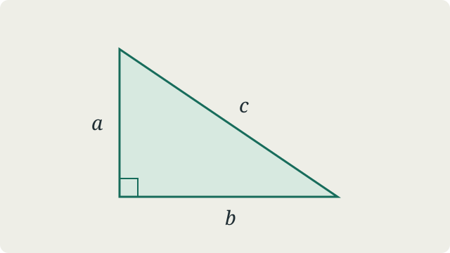

This notebook is a place for explanations, proofs, and small experiments. This first note doubles as a tour of the writing tools available here.

## Mathematics

Inline expressions such as $x \in \RR$ sit alongside the text. Longer arguments get room of their own.

:::theorem[Pythagorean theorem]{#pythagoras}
For a right triangle with legs $a,b$ and hypotenuse $c$,

$$
a^2 + b^2 = c^2.
$$

:::

:::proof
Arrange four identical right triangles inside a square of side $a+b$. The uncovered central square has side $c$, so

$$
(a+b)^2 = 4\cdot\frac{ab}{2} + c^2.
$$

Expanding and cancelling $2ab$ gives the result.
:::

:::figure[A right triangle with legs a and b and hypotenuse c.]{#right-triangle}

:::

You can link directly to [the theorem](#pythagoras) or [the illustration](#right-triangle).

### Definitions and observations

:::definition[Greatest common divisor]{#gcd}
For nonzero integers $a,b$, their greatest common divisor is the largest positive integer dividing both.
:::

:::lemma
If $a = qb + r$, then $\gcd(a,b)=\gcd(b,r)$.
:::

:::proposition
Repeated Euclidean division computes the greatest common divisor.
:::

:::corollary
Two integers are coprime precisely when the algorithm terminates with a last nonzero remainder of $1$.
:::

:::remark
A compact statement can still benefit from a concrete example.
:::

## Algorithms

The Euclidean algorithm turns the lemma above into a few lines of code.[^euclid]

```typescript
function gcd(a: number, b: number): number {
  while (b !== 0) [a, b] = [b, a % b];
  return Math.abs(a);
}
```

| Input  | First division         | Result |
| :----- | :--------------------- | -----: |
| 48, 18 | $48 = 2 \cdot 18 + 12$ |      6 |
| 35, 14 | $35 = 2 \cdot 14 + 7$  |      7 |
| 17, 5  | $17 = 3 \cdot 5 + 2$   |      1 |

## Keeping useful notes

::::note[Writing as a way of thinking]
A useful explanation makes its assumptions visible.

:::tip
Keep illustrations next to the post that uses them. Give statements descriptive anchors so they are easy to revisit.
:::
::::

:::warning
The JavaScript example uses floating-point numbers. For integers beyond the safe range, use `bigint` instead.
:::

More notes will follow as this notebook grows.

[^euclid]: Each division reduces the second argument, so the algorithm eventually terminates.
